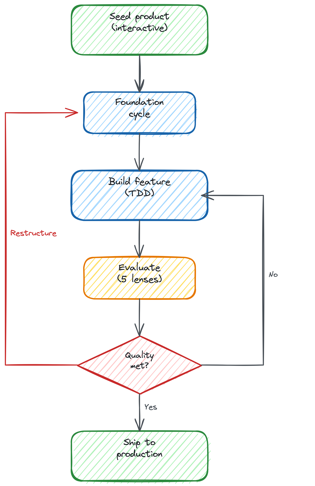

# The Rouge

<p align="center">
  <a href="https://www.npmjs.com/package/the-rouge"></a>
  <a href="https://www.npmjs.com/package/the-rouge"></a>
  <a href="LICENSE"></a>
  <a href="https://github.com/sponsors/gregario"></a>
</p>

In 1928, Ford opened the River Rouge Complex. Iron ore went in one end. Finished cars came out the other. Raw materials to finished product, under one roof.

Rouge is the software version. A product idea goes in. A deployed, tested, monitored application comes out.

Not one-shot code generation. Iterative product development: build, evaluate against external signals, fix, repeat until the quality bar is met. The same loop a good engineering team runs, except it runs overnight while you sleep.

## Quick start

```bash
npm install -g the-rouge

rouge init my-product
rouge seed my-product
rouge build my-product
rouge status
```

> **Experimental.** Rouge invokes Claude Code autonomously, deploys to real infrastructure, and makes real git commits. It could rack up your token usage, deploy broken code to staging, or commit something embarrassing. It will not, to our knowledge, sell your grandmother. Use at your own risk.

## How it works

<p align="center">
  
</p>

Inspired by [Karpathy's AutoResearch](https://github.com/karpathy/autoresearch). No long-running process. Each phase starts fresh, reads state from the filesystem, does one thing, saves, and exits. Git is the audit trail. The loop iterates as many times as it needs to. There's no fixed limit. It's done when it's done.

**Seed** — you describe the product. Eight discipline-specific personas run through it (brainstorming, competition, taste, spec, design, legal, marketing). About 10-20 minutes of your time. Then it's autonomous. [See a full seeding example.](docs/seeding-example.md)

**Build** — reads specs, writes code with TDD, deploys to staging. All work happens on a single branch with milestone tags per shipped feature area — no branch-per-story sprawl. State is tracked via a dual ledger: `task_ledger.json` for task tracking and `checkpoints.jsonl` for immutable cycle history.

**Evaluate** — five-lens assessment: test integrity, code review, browser QA, product evaluation, design review. One browser session, three evaluation lenses reading the same observation data. All evaluation prompts write output to `cycle_context.json` only — they never mutate the task ledger or project state directly. A strict I/O contract keeps evaluation data readable by the analyse phase without side-effects.

**Analyse** — reads all reports, classifies root causes, decides: fix, advance to the next feature, restructure the architecture, or ship.

The loop runs until all feature areas meet the quality bar. Then it promotes to production and pings you on Slack.

## Composable decomposition

This is the core innovation. A timer app needs no decomposition. A fleet management system with trips, vehicles, a dashboard, maps, and a trip simulator needs a completely different approach.

Rouge derives a **complexity profile** from your spec. Measurements, not categories. How many entities share relationships? How many integrations? How dense is the dependency graph? These measurements activate composable capabilities:

| Capability | What it does |
|-----------|-------------|
| Foundation cycle | Horizontal infrastructure pass (schema, auth, integrations) before any features |
| Dependency ordering | DAG-resolved build order for feature areas |
| Integration escalation | Hard blocks on missing patterns instead of silently degrading |
| Foundation evaluation | Structural review (schema completeness), not user journeys |
| Infrastructure discipline | Explicit eighth discipline: CI/CD, environment configuration, secrets management, observability setup treated as first-class deliverables, not afterthoughts |

A timer app activates nothing. A Fleet management SaaS activates everything. Same system, different measurements.

**The capability avoidance problem.** Without this, the builder optimises for what it CAN build, not what the product NEEDS. No maps pattern? It substitutes a table of coordinates. Every test passes. The product is useless. Rouge's fix: hard blocking. If maps are needed and the pattern doesn't exist, Rouge blocks and pings you on Slack. It either builds the pattern autonomously (researches the API, evaluates scale trade-offs, creates a wrapper) or escalates. When it does build that pattern, it gets added to the catalogue. The next product that needs maps doesn't start from scratch.

**The backwards flow.** Sometimes the decomposition is wrong. The analysing phase detects the structural issue and inserts a foundation cycle mid-flight, like a startup pivot at a smaller scale. Autonomous when bounded. Escalates when it isn't.

## The integration catalogue

Three tiers of patterns that grow as Rouge builds products:

- **Stacks** — language, framework, runtime (Next.js on Cloudflare, Godot, etc.)
- **Services** — external services with lifecycle (Supabase, Stripe, Sentry, Counterscale)
- **Integrations** — code patterns within services (Stripe checkout, Supabase RLS, Sentry error boundary)

Each entry has setup guides, env vars, free tier limits, scale considerations, and working code. The catalogue ships with seed entries and grows as Rouge builds products. When a foundation cycle creates a new integration pattern, Rouge automatically drafts a catalogue entry and opens a PR to contribute it back. Every product Rouge builds potentially makes Rouge better at building the next one.

## The Library

Rouge's accumulated design intelligence. Not documentation. Machine-readable context that feeds into every phase.

- **Global standards** — 15 universal quality heuristics (page load, accessibility, error recovery)
- **Domain-specific taste** — grows per domain (web apps, APIs, games)
- **Learned judgment** — accumulated from your feedback. Your Rouge learns your taste.

Taste encoded as testable signals: "page load under 2 seconds," "core tasks in 3 clicks or fewer," "primary content in dominant visual position."

## Economics

Rouge runs on your Claude Code subscription. Each phase consumes session time (roughly 10-20 minutes of model time). A simple product takes a few hours. A complex product might take a day or more across sessions.

Rouge uses per-phase model selection: Opus for reasoning-heavy phases (analyse, architecture, backwards flow), Sonnet for mechanical phases (formatting, catalogue entry drafting, status updates). In practice this delivers a 40-50% cost reduction versus running everything on Opus.

If you run via API keys, token costs apply:

| Product size | API cost | Session time |
|-------------|----------|-------------|
| Small (1-3 features) | $5-20 | 2-4 hours |
| Medium SaaS (5-10 features) | $50-150 | 1-3 days |
| Large SaaS (10+ features) | $150-400 | 3-7 days |

Infrastructure (Cloudflare free tier, Supabase free tier) adds nothing for small projects. Run `rouge cost <project>` for estimates.

## Built with

- **[AI Factory](https://github.com/gregario/AI-Factory)** by Greg Jackson — the factory that built Rouge
- **[GStack](https://github.com/garrytan/gstack)** by Garry Tan — browser automation and QA patterns that inspired Rouge's evaluation system
- **[Superpowers](https://github.com/claude-plugins-official/superpowers)** by Jesse Vincent — engineering discipline skills
- **[OpenSpec](https://github.com/openspecio/openspec)** — product specification and task management
- **[Excalidraw](https://excalidraw.com)** — hand-drawn diagrams
- **[Supabase](https://supabase.com)** — database, auth, and storage for products Rouge builds
- **[Cloudflare Workers](https://workers.cloudflare.com)** — deployment target for products Rouge builds

## Getting started (detailed)

```bash
npm install -g the-rouge
```

Or clone from source:
```bash
git clone https://github.com/gregario/the-rouge.git
cd the-rouge && npm install
```

### Prerequisites

- **Claude Code CLI** — the execution engine for every phase
  ```bash
  npm install -g @anthropic-ai/claude-code
  ```
  Requires a [Claude subscription](https://claude.ai/code) (Pro or Max). Verify: `claude --version`
- **Node.js 18+** — launcher, Slack bot, scripts
- **Git** — every phase commits
- **[GStack browse](https://github.com/garrytan/gstack)** — required for web product evaluation (macOS only; Playwright fallback on the roadmap). Follow the [GStack install guide](https://github.com/garrytan/gstack#installation). Verify: `rouge doctor`
- **[Slack App](docs/slack-setup.md)** — notifications and control plane (start, pause, monitor from your phone)

Optional:
- **Wrangler CLI** — Cloudflare Workers deployment
- **Supabase CLI** — database, auth, storage

Run `rouge doctor` to verify all prerequisites are installed.

### Set up integrations

```bash
rouge setup supabase
rouge setup stripe
rouge secrets list
```

Secrets stored in your OS credential store (macOS Keychain, Linux secret-service, Windows Credential Manager). Rouge never sees the values.

### Set up Slack

```bash
rouge slack setup     # Prints step-by-step guide
rouge setup slack     # Store tokens
rouge slack start     # Start the bot
rouge slack test      # Verify
```

See [docs/slack-setup.md](docs/slack-setup.md) for the full guide.

### Build a product

```bash
rouge init my-product
rouge seed my-product       # Interactive seeding (~10-20 min)
rouge build my-product      # Start the Karpathy Loop
rouge status                # Check progress
rouge cost my-product       # See cost estimate
```

## Safety

Rouge includes a safety layer that validates every phase before execution:

- **Blocked commands** — shell commands that could cause irreversible damage are blocked at the prompt level
- **Deploy blocking** — only staging and preview deploys allowed by default. Production promotion requires passing the full evaluation pipeline and explicit milestone lock
- **Cost caps** — per-session and per-project token budgets enforced; the loop pauses and pings Slack when limits are hit
- **Spin detection** — repeated identical failures across cycles trigger escalation rather than infinite retry
- **Milestone lock** — features are locked after shipping; the loop cannot regress or re-open closed milestones without explicit override
- **Audit trail** — every phase writes a signed entry to `checkpoints.jsonl`; the full history is git-committed and tamper-evident
- **Custom pre-hooks** — `rouge.config.json` supports project-level safety hooks

For common issues, see [troubleshooting](docs/troubleshooting.md).

## Contributing

See [CONTRIBUTING.md](CONTRIBUTING.md).

**Integration catalogue entries** — service adapters (Tier 2) or code patterns (Tier 3). Each product you build with Rouge can contribute patterns back. All contributions reviewed by maintainers. This is the fastest way to expand what Rouge can build.

**Stack support** — new deployment targets, frameworks, runtimes. This is how Rouge goes from "builds web apps" to "builds tech products."

**Bug reports and prompt improvements** — if Rouge produces bad output, the fix is usually in a prompt. PRs welcome.

## What's next

Rouge currently builds web products on Next.js with Cloudflare and Supabase. The architecture is stack-agnostic. What it can build depends on what stacks and integrations are in the catalogue, and we aim to grow that with the help of contributions.

### Rouge Grow

Feature expansion on shipped products. Works from a known state (built by Rouge or onboarded via Embed), respects existing users and data, reads analytics or Rouge Spec inputs to decide what to build next.

### Rouge Maintain

Autonomous production upkeep. SBOM scanning, bug triage, dependency updates, performance regression detection. No new features. Just keeping the lights on.

### Rouge Embed

Bring an existing codebase into the loop. Three phases: understanding (reverse-engineer into specs), standardisation (decouple, clean up, remove mystery hooks), handoff (now Maintain and Grow can operate on it).

### V3 capabilities

- **Self-improvement** — after each completed product, Rouge reviews its own prompts and catalogue entries against what worked and what didn't. Improvement suggestions are drafted as PRs, not applied silently.
- **Linked project dependencies** — a project registry allows Rouge to understand that Product B depends on a shared service built by Product A. The dependency resolver ensures changes to a shared service are evaluated for downstream impact before shipping.

Early access to [sponsors](https://github.com/sponsors/gregario) as they're built.

## License

[PolyForm Noncommercial 1.0.0](LICENSE)

Free for personal and non-commercial use. Personal projects, research, learning, tinkering, hobby work, education.

Commercial use available via the [$100/month Commercial tier on GitHub Sponsors](https://github.com/sponsors/gregario).
