# The Rouge — Full Flow with Inputs, Outputs & North Stars

## The Complete Loop

```mermaid
graph TB
    subgraph SEEDING["🌱 SEEDING PHASE (Interactive, Human-in-the-loop)"]
        direction TB

        IDEA["💡 Human drops idea<br/>(voice note, text, backlog item)"]

        subgraph SWARM["Seeding Swarm (Non-linear, disciplines loop back)"]
            direction LR
            BRAIN["🧠 Brainstorming<br/>───────────<br/>North star: 10x vision<br/>───────────<br/>IN: raw idea, Library<br/>(global standards, domain<br/>taste, fingerprint)<br/>───────────<br/>OUT: expanded vision,<br/>delight opportunities,<br/>user outcomes"]

            COMP["🔍 Competition<br/>Review<br/>───────────<br/>North star: differentiation<br/>───────────<br/>IN: expanded vision<br/>───────────<br/>OUT: competition brief,<br/>gap analysis,<br/>differentiation angle"]

            TASTE["👅 Product Taste<br/>───────────<br/>North star: is this<br/>worth building?<br/>───────────<br/>IN: vision, competition<br/>brief, Library<br/>───────────<br/>OUT: expand/hold/reduce<br/>verdict, sharpened<br/>problem statement"]

            SPEC["📋 Spec Definition<br/>───────────<br/>North star: comprehensive<br/>feature coverage<br/>───────────<br/>IN: taste verdict,<br/>competition brief<br/>───────────<br/>OUT: feature areas,<br/>user journeys (step-by-step),<br/>acceptance criteria,<br/>data model sketches,<br/>edge cases"]

            DESIGN_C["🎨 Design Challenge<br/>───────────<br/>North star: can this<br/>spec produce good UX?<br/>───────────<br/>IN: spec, Library<br/>heuristics, reference<br/>products<br/>───────────<br/>OUT: UX validation,<br/>3-click violations,<br/>hierarchy feasibility,<br/>progressive disclosure<br/>assessment"]

            BRAIN -->|"vision"| COMP
            COMP -->|"brief"| TASTE
            TASTE -->|"verdict"| SPEC
            SPEC -->|"spec"| DESIGN_C
            DESIGN_C -->|"🔄 UX issue"| SPEC
            SPEC -->|"🔄 scope issue"| TASTE
            TASTE -->|"🔄 expand/reduce"| BRAIN
            DESIGN_C -->|"🔄 competition gap"| COMP
        end

        IDEA --> SWARM

        CONVERGE{"All disciplines<br/>run ≥1 time?<br/>No new loop-backs?"}
        SWARM --> CONVERGE
        CONVERGE -->|"No"| SWARM

        subgraph SEED_GEN["Seed Generation"]
            VISION_DOC["📄 Vision Document<br/>───────────<br/>Structured YAML:<br/>• name, persona, problem<br/>• emotional north star<br/>• reference products + dimensions<br/>• feature areas + journeys<br/>• acceptance criteria"]

            PROD_STD["📏 Product Standard<br/>───────────<br/>• inherits: global + domain<br/>• overrides with justification<br/>• project-specific additions<br/>• definition of done"]

            SEED_SPEC["📦 Seed Spec<br/>───────────<br/>Per feature area:<br/>• user journeys (step-by-step)<br/>• acceptance criteria (QA)<br/>• PO checks (instantiated<br/>  from Library templates)<br/>• data model sketch<br/>• interaction patterns<br/>• edge cases<br/>• scope boundaries"]

            PO_CHECKS["✅ PO Check Set<br/>───────────<br/>Per journey step:<br/>• feedback checks (200ms response)<br/>• clarity checks (≤2 competing)<br/>• efficiency checks (step necessity)<br/>• delight checks (contextual copy)<br/>• transition checks (animated)<br/>Per screen:<br/>• hierarchy (named primary)<br/>• density (min datapoints)<br/>Per interaction:<br/>• type-specific checks"]
        end

        CONVERGE -->|"Yes"| SEED_GEN

        APPROVE{"Human approves seed?<br/>───────────<br/>Summary: N features,<br/>N QA criteria,<br/>N PO checks,<br/>definition of done"}
        SEED_GEN --> APPROVE
        APPROVE -->|"Revise"| SWARM
    end

    APPROVE -->|"✅ Approved"| CONTEXT_INIT

    subgraph CONTEXT["📂 SHARED CONTEXT (cycle_context.json)"]
        CONTEXT_INIT["Initialize shared context<br/>───────────<br/>• Full vision document<br/>• Full product standard<br/>• Full seed spec + PO checks<br/>• All Library heuristics<br/>• Reference product screenshots<br/>• Empty: factory_decisions,<br/>  evaluator_observations,<br/>  confidence_history"]
    end

    CONTEXT_INIT --> GRANULARITY

    GRANULARITY{"Cycle granularity?<br/>───────────<br/>1 feature area → whole-product<br/>2+ feature areas → per-area<br/>(ordered by dependency)"}

    subgraph AUTONOMOUS["🔄 AUTONOMOUS LOOP (No human until done or pivot)"]
        direction TB

        subgraph BUILD["🏗️ FACTORY BUILD"]
            FACTORY["The Factory<br/>───────────<br/>North star: implement<br/>the active spec<br/>───────────<br/>IN: full cycle_context.json<br/>• active spec (seed or change)<br/>• product standard<br/>• Library heuristics<br/>• reference products<br/>• previous evaluations<br/>• previous factory decisions<br/>───────────<br/>OUT (writes to context):<br/>• deployment URL<br/>• what was implemented<br/>• what was skipped + why<br/>• factory_decisions (every<br/>  significant choice + rationale)<br/>• factory_questions (ambiguities<br/>  + how resolved)<br/>• divergences from spec"]
        end

        subgraph QA_PHASE["🔍 QA GATE — 'Does it match the spec?'"]
            QA["QA Gate<br/>───────────<br/>North star: spec compliance<br/>───────────<br/>IN: deployment URL,<br/>active spec criteria,<br/>previous code quality baseline<br/>───────────<br/>CHECKS:<br/>• Acceptance criteria (binary)<br/>• Page loads (all routes)<br/>• Console errors (zero)<br/>• Interactive elements (respond)<br/>• Forms (submit + validate)<br/>• Navigation (no dead links)<br/>───────────<br/>COLLECTS (informational):<br/>• Lighthouse baselines<br/>• Code quality baselines<br/>  (complexity, duplication,<br/>  file sizes, warnings,<br/>  dead code, coverage)<br/>• Architecture integrity<br/>  (dependency graph, circular<br/>  deps, layer violations,<br/>  API contract diff)<br/>───────────<br/>OUT: QA report<br/>• verdict: PASS / FAIL<br/>• criteria results<br/>• performance baseline<br/>• code quality baseline<br/>• code_quality_warning flag"]

            QA_FAIL{"QA verdict?"}
            QA --> QA_FAIL

            BUG_FIX["Bug Fix Brief<br/>───────────<br/>Same spec, fix the code<br/>No design mode needed<br/>───────────<br/>IN: QA failure report<br/>OUT: back to Factory"]

            QA_FAIL -->|"FAIL"| BUG_FIX
            BUG_FIX -->|"retry ≤3"| FACTORY
        end

        subgraph PO_PHASE["⭐ PO REVIEW — 'Is it actually good?'"]
            PO["PO Review<br/>───────────<br/>North star: production quality<br/>per Library + product standard<br/>───────────<br/>IN: deployment URL,<br/>QA report (with baselines),<br/>full cycle_context.json,<br/>factory_decisions (for root cause),<br/>PO check set,<br/>Library heuristics,<br/>reference products<br/>───────────<br/>EXECUTES MECHANICALLY:<br/>───────────<br/>Journey quality:<br/>• Per step: run instantiated<br/>  feedback/clarity/efficiency/<br/>  delight/transition checks<br/>• Per step: pass/fail per check<br/>• Step rating: strong/weak/failing<br/>• Journey verdict: production-ready/<br/>  acceptable/not-ready<br/>───────────<br/>Screen quality:<br/>• Per screen: run hierarchy/<br/>  density/consistency/mobile/<br/>  edge-state checks<br/>• Screen verdict: production-ready/<br/>  acceptable/not-ready<br/>───────────<br/>Interaction quality:<br/>• Per interaction: hover/click/<br/>  loading/success/transition checks<br/>• Rating: polished/functional/raw<br/>───────────<br/>Reference comparison:<br/>• Per dimension: pairwise LLM<br/>  vision judgment with screenshots<br/>• matches/approaching/below<br/>───────────<br/>Root cause analysis:<br/>• Read factory_decisions<br/>• Classify: spec ambiguity /<br/>  design choice / missing context<br/>───────────<br/>OUT: PO Review report<br/>• verdict: PRODUCTION_READY /<br/>  NEEDS_IMPROVEMENT / NOT_READY<br/>• quality gaps (each with evidence,<br/>  what good looks like, root cause,<br/>  improvement category)<br/>• confidence score (weighted)<br/>• recommended action"]
        end

        subgraph ANALYSIS["🧭 RUNNER ANALYSIS"]
            ANALYZE["Runner Analyzes<br/>───────────<br/>North star: progress toward<br/>vision with rising confidence<br/>───────────<br/>IN: PO Review report,<br/>full cycle_context.json,<br/>confidence history<br/>───────────<br/>DECISIONS:<br/>• confidence ≥0.9 + PRODUCTION_READY<br/>  → continue (next area or done)<br/>• 0.7-0.9 + gaps concentrated<br/>  → deepen (quality improvement spec)<br/>• 0.7-0.9 + missing capabilities<br/>  → broaden (add to feature queue)<br/>• root cause = spec ambiguity<br/>  → refinement loop (not new cycle)<br/>• code_quality_warning<br/>  → refactoring cycle<br/>• <0.7 or NOT_READY + critical<br/>  → notify human<br/>───────────<br/>OUT: next action"]

            CHANGE_SPEC["Quality Improvement Spec<br/>───────────<br/>NOT a bug fix — a NEW spec<br/>Goes through full pipeline<br/>(design mode → implement →<br/>QA → PO Review)<br/>───────────<br/>• requires_design_mode: true<br/>• gaps with evidence +<br/>  what_good_looks_like<br/>• root cause classification<br/>• affected screens/journeys<br/>• Library context<br/>• improvement category<br/>• priority order"]

            REFINE["Refinement Loop<br/>───────────<br/>Spec ambiguity detected —<br/>don't start new cycle,<br/>clarify within current one<br/>───────────<br/>Send ambiguity back to<br/>relevant discipline,<br/>update shared context,<br/>resume current cycle"]

            REFACTOR["Refactoring Cycle<br/>───────────<br/>Code quality degrading —<br/>pause features, clean up<br/>───────────<br/>• Reduce complexity<br/>• Eliminate duplication<br/>• Fix architecture violations<br/>• No new features"]
        end

        subgraph VISION_CHECK["🔭 VISION CHECK"]
            VISION["Vision Check<br/>───────────<br/>North star: the original vision<br/>───────────<br/>IN: vision document,<br/>all completed feature areas,<br/>confidence history<br/>───────────<br/>ASKS:<br/>• Still aligned with vision?<br/>• Vision itself incomplete/wrong?<br/>• Emergent interactions between<br/>  features changing direction?<br/>• Remaining work still makes sense?<br/>───────────<br/>OUT: vision check report<br/>• alignment assessment<br/>• scope expansion recommendations<br/>• confidence level"]

            EXPAND["Scope Expansion<br/>───────────<br/>confidence >80%: proceed<br/>70-80%: proceed + flag<br/><70%: escalate to human"]

            PIVOT["Pivot Proposal<br/>───────────<br/>Fundamental premise wrong<br/>→ notify human with evidence<br/>and structured proposal"]
        end

        GRANULARITY --> FACTORY
        FACTORY --> QA
        QA_FAIL -->|"PASS"| PO
        PO --> ANALYZE
        ANALYZE -->|"deepen/broaden"| CHANGE_SPEC
        CHANGE_SPEC --> FACTORY
        ANALYZE -->|"spec ambiguity"| REFINE
        REFINE --> QA
        ANALYZE -->|"code quality warning"| REFACTOR
        REFACTOR --> FACTORY
        ANALYZE -->|"continue +<br/>more areas"| VISION
        VISION -->|"aligned"| FACTORY
        VISION -->|"expand"| EXPAND
        EXPAND --> FACTORY
        VISION -->|"premise wrong"| PIVOT
    end

    ANALYZE -->|"continue +<br/>all areas done"| DONE
    PIVOT --> NOTIFY_PIVOT

    subgraph HUMAN["👤 HUMAN TOUCHPOINTS"]
        DONE["🟢 Product Ready<br/>───────────<br/>Slack notification:<br/>• deployment URL<br/>• build time + cycles<br/>• quality summary<br/>• confidence score<br/>• screenshots"]

        NOTIFY_PIVOT["🟡 Pivot Needed<br/>───────────<br/>Slack notification:<br/>• what's wrong + why<br/>• what was tried<br/>• options A/B/C/D"]

        MORNING["☀️ Morning Briefing<br/>───────────<br/>Daily at 8am:<br/>• cycles overnight<br/>• per-area progress<br/>• decisions made<br/>• items needing input<br/>• confidence trend<br/>• screenshots"]

        SATURDAY["📊 Saturday Demo<br/>───────────<br/>Weekly portfolio review:<br/>• all products worked on<br/>• per-product status + URL<br/>• Library growth stats<br/>• meta-loop findings"]

        FEEDBACK["💬 Human Feedback<br/>───────────<br/>IN: voice/text via Slack<br/>───────────<br/>PARSED INTO:<br/>• product-change → change spec<br/>• global-learning → Library global<br/>• domain-learning → Library domain<br/>• personal-preference → fingerprint<br/>• direction → Runner state change"]

        DONE --> FEEDBACK
        NOTIFY_PIVOT --> FEEDBACK
    end

    FEEDBACK -->|"change specs"| CHANGE_SPEC
    FEEDBACK -->|"Library updates"| LIBRARY_UPDATE

    subgraph LIBRARY["📚 THE LIBRARY (Persistent, cross-project)"]
        LIBRARY_UPDATE["Library Updates<br/>───────────<br/>Global standards (functional + non-functional)<br/>Domain taste (web / games / artifacts)<br/>Personal fingerprint (weighted preferences)<br/>PO check templates (given/when/then)<br/>───────────<br/>Grows from:<br/>• Human feedback (tagged global/domain/personal)<br/>• Self-evaluation observations<br/>• Cross-project retrospectives<br/>───────────<br/>Fed INTO every new product's<br/>seeding phase"]
    end

    subgraph META["🔄 META-LOOP (Every 5 products)"]
        META_ANALYSIS["Cross-Product Analysis<br/>───────────<br/>IN: all evaluation reports<br/>across completed products<br/>───────────<br/>DETECTS:<br/>• Same heuristic failing 3+ products<br/>• Factory-level vs product-level issues<br/>• Recurring quality gaps<br/>───────────<br/>OUT: Factory improvement specs<br/>targeting stacks, skills, templates"]
    end

    LIBRARY_UPDATE --> LIBRARY
    LIBRARY -->|"standards +<br/>templates"| SWARM
    META_ANALYSIS -->|"improvement specs"| FACTORY
```

## Inputs/Outputs Summary Table

| Stage | North Star | Key Inputs | Key Outputs | Failure Mode |
|-------|-----------|------------|-------------|--------------|
| **Brainstorming** | 10x vision | Raw idea, Library | Expanded vision, user outcomes | Too narrow / too broad |
| **Competition Review** | Differentiation | Expanded vision | Gap analysis, differentiation angle | Missing key competitor |
| **Product Taste** | Worth building? | Vision, competition, Library | Expand/hold/reduce verdict | Approving a bad idea |
| **Spec Definition** | Comprehensive coverage | Taste verdict, competition | Feature areas, journeys, criteria, edge cases | Shallow specs (the known problem) |
| **Design Challenge** | Can spec → good UX? | Spec, Library, references | UX validation, violations found | Missing UX issues |
| **Seed Generation** | Parseable by Evaluator | Swarm outputs | Vision doc (YAML), product standard, seed spec, PO checks | Ambiguous criteria |
| **Factory Build** | Implement the spec | Full cycle_context.json | Deployed product + decisions + questions | Misinterpreting spec |
| **QA Gate** | Spec compliance | Deployment URL, spec criteria | PASS/FAIL + baselines | Missing bugs |
| **PO Review** | Production quality | Deployment, PO checks, Library, factory decisions | Quality gaps + root cause + confidence | False positive (says "good" when it's not) |
| **Runner Analysis** | Progress toward vision | PO report, confidence history | Next action (continue/deepen/broaden/notify) | Wrong action choice |
| **Vision Check** | Original vision alignment | Vision doc, all completed work | Alignment + scope recommendations | Missing drift |
| **Notifier** | Right info at right time | Events from all phases | Slack messages, morning briefings | Over-notifying or under-notifying |
| **Library** | Accumulated taste | Feedback, self-evaluation, retros | Heuristics, check templates, fingerprint | Stale or conflicting entries |

## Key Flows to Note

**The QA → PO Review boundary:**
- QA failures = bug fixes (same spec, just fix the code)
- PO Review failures = NEW specs (design + implement, full pipeline)
- These are fundamentally different outputs driving different actions

**The shared context prevents sequential handover:**
- Factory writes decisions/questions INTO context
- Evaluator reads Factory decisions for root cause analysis
- Runner reads full context to generate change specs that address actual root cause
- Context accumulates across cycles (cycle 5 knows what cycles 1-4 tried)

**The refinement loop prevents unnecessary new cycles:**
- If root cause is spec ambiguity → clarify within current cycle, don't restart
- Mirrors agile refinement (questions go back to PM/designer before re-estimation)

**Three types of "back to Factory":**
1. Bug fix brief (from QA) → straight to implementation, no design mode
2. Quality improvement spec (from PO Review) → full pipeline: design mode → implement → QA → PO Review
3. Refactoring cycle (from code quality warning) → structural cleanup, no new features
