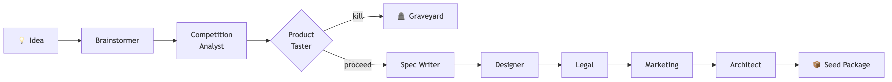
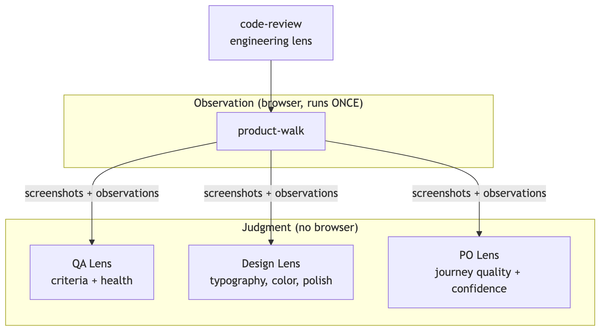
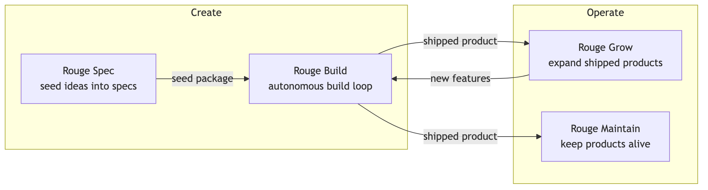

# How Rouge Works

## The Name

In 1928, Ford opened the River Rouge Complex — a factory so vertically integrated that iron ore and rubber went in one end, and finished automobiles came out the other. Raw materials to finished product, under one roof.

Rouge is the software equivalent. A product idea goes in. A deployed, tested, monitored application comes out. No human writes code. No human triages bugs. The system builds, tests, evaluates, and ships — pausing only when it needs a product decision it cannot make itself.

Let's watch it build a product from scratch.

---

## The Idea

The product: **Epoch** — a focus timer that's beautiful enough to leave on screen.

A Pomodoro timer for knowledge workers who have tried every timer app and found them either ugly or bloated. The kind of app you leave visible on your second monitor all day — not because you have to, but because it's pleasant to look at.

- **Emotional north star**: "From 'where did the last 3 hours go?' to 'I can see my focus happening.'"
- **Aesthetic**: Techno-futuristic. Frosted glass, subtle glows, precise typography. Linear's design language meets a high-end watch face.
- **Scope**: Full Pomodoro cycle, configurable settings, session counter, keyboard shortcuts, synthesized audio chime. No accounts, no history beyond today, no themes, no task lists.
- **Differentiator**: Optimizes for *presence* — how it feels on your screen — not for features. The design IS the product.

---

## Seeding: From Idea to Plan

The idea entered Rouge through **Rouge Spec**, the interactive seeding phase. A human describes what they want to build in a Slack conversation, and an eight-persona AI swarm turns that conversation into a buildable plan.

Each persona interrogates the idea from a different angle:

| # | Persona | Role |
|---|---------|------|
| 1 | **Brainstormer** | Expand the idea — 10-star version, emotional core, target user |
| 2 | **Competition Analyst** | Map the landscape — what exists, where's the gap |
| 3 | **Product Taster** | Challenge the idea — kill it or scope it |
| 4 | **Spec Writer** | Convert vision into feature areas + acceptance criteria |
| 5 | **Designer** | Three-pass: UX architecture → components → visual design |
| 6 | **Legal Advisor** | Privacy, terms, compliance |
| 7 | **Marketing Strategist** | Positioning, landing page, launch strategy |
| 8 | **Technical Architect** | Stack selection, infrastructure, deployment target |

The human participates throughout — answering questions, making taste decisions, vetoing bad ideas. The Product Taster is the hard gate: ideas that aren't worth building die before any specs are written.

The output is a **seed package**: vision document, six feature area specifications with 37 acceptance criteria, a complete design system, and a deployment target.

---

## The Karpathy Loop: From Plan to Product

Rouge builds products through an iterative loop inspired by how neural networks train: build, evaluate, adjust, repeat. Each cycle advances the product toward convergence with the vision.

| Phase | What happens | Browser? |
|-------|-------------|:---:|
| **building** | Write code, run tests, deploy to staging | No |
| **test-integrity** | Verify all tests pass, no regressions | No |
| **code-review** | Engineering audit — architecture, dead code, security | No |
| **product-walk** | Open browser, screenshot every state, record observations | Yes |
| **evaluation** | Three lenses judge the observations (QA, Design, PO) | No |
| **analyzing** | Decide: ship, improve, or escalate | No |
| **vision-checking** | Compare built product against original vision | No |
| **promoting** | Advance to next cycle or trigger final review | No |
| **final-review** | Holistic "use it as a customer" walkthrough | Yes |

The browser opens exactly once per cycle. All three evaluation lenses judge the same observation data. This is the **observe-once, judge-through-lenses** architecture.

---

## Building Epoch

### Cycle 1: Everything at Once

Rouge built all six feature areas in a single cycle: Pomodoro engine, timer display, controls, cycle indicator, session counter, and settings modal. It chose Web Audio API for the chime (zero dependencies), CSS Modules for the frosted glass effects, and Date.now()-based timing (immune to background tab throttling).

89 tests passing. Deployed to Cloudflare Workers.

### Cycle 2: The Quality Ratchet

The evaluation found concrete issues:

| Issue | Fix |
|-------|-----|
| No crash recovery | ErrorBoundary with styled dark fallback |
| Settings modal used a div overlay | Native `<dialog>` element (automatic focus trap, Escape) |
| Footer text contrast 3.2:1 | Fixed to WCAG AA compliance |
| No semantic landmarks | `<header>`, `<main>`, `<footer>` |
| Keyboard shortcuts undiscoverable | Inline hints below controls |

Health score: 68 → **82**. Accessibility: 89 → **100**.

### Cycles 3–5: Convergence

Each subsequent cycle refined further — polishing interactions, improving architecture, converging on the vision. The system tracked confidence across cycles and quality metrics stabilised.

---

## The Final Product

After 5 cycles, Rouge produced a deployed Pomodoro timer that met its vision.

> "Epoch has converged strongly on its vision. The core promise — a focus timer beautiful enough to leave on screen — is delivered through a cohesive techno-futuristic aesthetic, atmospheric phase transitions, and purposeful minimalism."

| Metric | Score |
|--------|:-----:|
| Tests passing | 90 |
| Acceptance criteria | 67/67 (100%) |
| Health score | 82/100 |
| Lighthouse | 91 / 100 / 100 / 100 |
| AI code audit | 90/100 |
| Design score | 86/100 |
| AI slop score | 6/100 (doesn't feel AI-generated) |
| PO confidence | 0.89 |
| Journey quality | All 6 rated "polished" |

---

## How It Judges

Rouge does not evaluate products through vibes. Every judgment is structured data with evidence.

### Three lenses on one observation

**code-review** runs CLI tools: ESLint, dependency audit, duplication detection, dead code analysis, and a seven-dimension AI code audit. No browser needed.

**product-walk** opens the browser once, navigates every screen state, clicks every element, tests keyboard navigation, captures screenshots and accessibility trees. Then the browser closes.

**evaluation** reads both reports and applies three lenses:
- **QA lens**: Does the product match the spec? 67 criteria checked with evidence.
- **Design lens**: Does it look and feel like a real product? 8 categories scored, plus AI slop detection.
- **PO lens**: Will this delight customers? Journey quality, screen quality, confidence score.

### Real tools, not vibes

| Tool | Purpose |
|------|---------|
| GStack | Headless Chromium — click, type, screenshot, test keyboard navigation |
| Lighthouse | Performance, accessibility, best practices, SEO |
| ESLint | Lint errors |
| jscpd | Duplication |
| madge | Circular dependencies |
| knip | Dead code |
| npm audit | Dependency vulnerabilities |
| AI code audit | Architecture, consistency, robustness, security, tech debt (7 dimensions) |

---

## Under the Hood

### The stack

Rouge is a Node.js orchestrator that drives Claude via the Anthropic API. Every product it ships gets a full production stack, provisioned automatically:

| Layer | Tool | Provisioned by |
|-------|------|---------------|
| Hosting | Cloudflare Workers | Rouge — automatic |
| Database | Supabase (Postgres + Auth) | Rouge — automatic |
| Payments | Stripe | Rouge — sandbox, human activates production |
| Error monitoring | Sentry | Rouge — auto-creates project per product |
| Analytics | PostHog (EU) | Rouge — shared project, product-tagged |
| Session recording | PostHog | Included with analytics |
| CI/CD | GitHub Actions | Template — ships with project |
| Security headers | CSP, HSTS, X-Frame-Options | Template — ships with project |
| i18n | next-intl (Claude-translated) | Template — ships with project |
| Legal pages | Privacy + Terms scaffolds | Template — ships with project |

### Slack integration

Rouge is controlled entirely from Slack:
- `@Rouge` starts a seeding conversation
- App Home dashboard shows all projects with health scores, confidence, staging URLs
- `/rouge start`, `/rouge pause`, `/rouge ship`, `/rouge feedback`
- Phase transitions and escalations post as rich notifications
- Final review: human tests the staging URL at their own pace

### Automatic management

- Deployment with health check and auto-rollback on failure
- Database migrations with dry-run preview and destructive operation detection
- State snapshots before every phase for corruption recovery
- Self-calibrating cost estimation from actual run data
- Cross-product learning: each completed product enriches a personal Library

---

## Cost

Epoch consumed **$8.53 of Opus compute** across 108 minutes of active execution. Five cycles, building through shipping.

A human developer would spend 1-2 weeks on the same scope. At $100-150/hour, that's $4,000-12,000. Rouge: under $10. Three orders of magnitude cheaper.

The real cost was building Rouge itself. But that amortizes across every product it builds after the first.

---

## The Vision

### Rouge Spec — "What to build"
Human + AI co-design a product through Slack conversation. Eight discipline-specific personas. Produces vision, specs, design, and infrastructure plan.

### Rouge Build — "How to build it"
The Karpathy Loop. Autonomous build-evaluate-improve cycles until quality converges. This is what built Epoch.

---

The goal: describe a product over coffee, approve a cost estimate, come back to a deployed, monitored, production-ready application.

Rouge handles everything between the idea and the first user.
