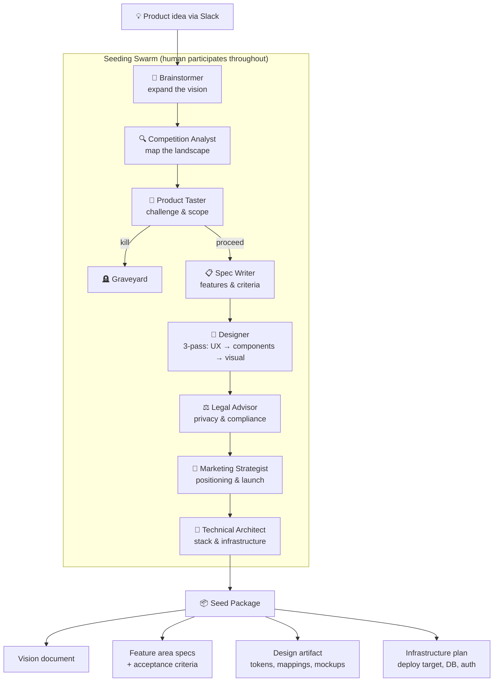
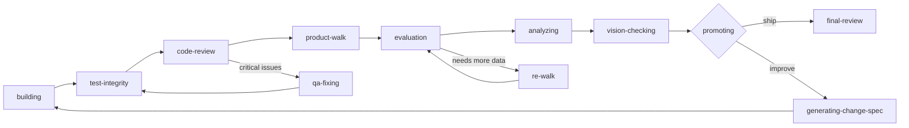
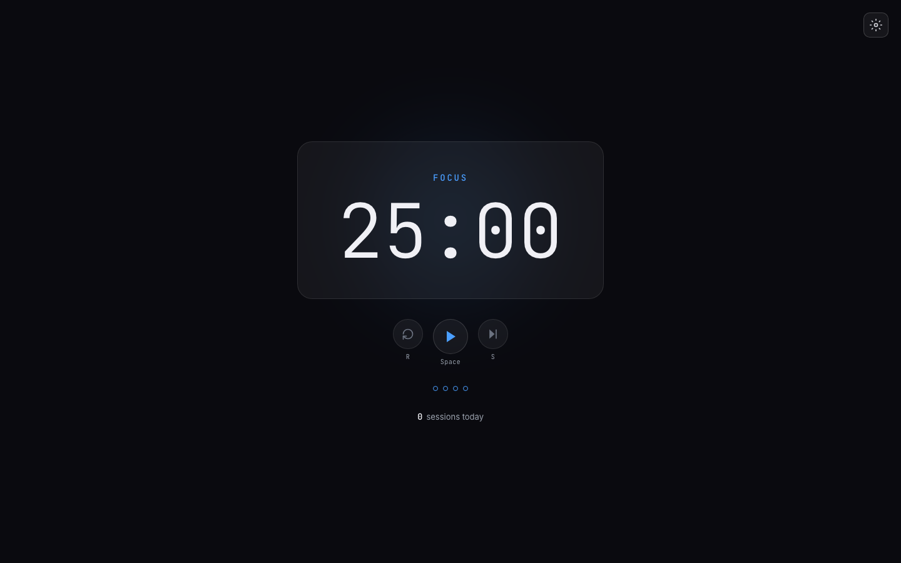
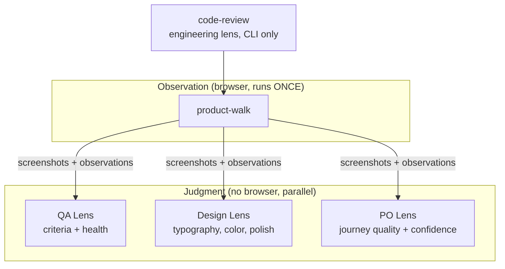
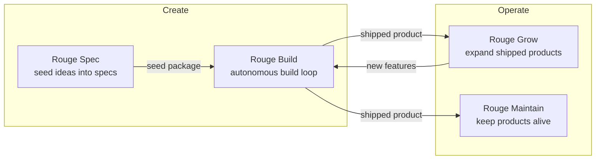

# How Rouge Works: Building Epoch from Scratch

Rouge is an autonomous product development system. It takes a product idea, refines it through interactive Slack conversation, then runs an iterative build-evaluate-improve loop until the product meets a quality bar. No human writes code. No human triages bugs. The system builds, tests, evaluates, and ships — pausing only when it needs a product decision it cannot make itself.

Let's watch it build a product from scratch.

---

## The Idea

The product: **Epoch** — a focus timer that's beautiful enough to leave on screen. A Pomodoro timer for knowledge workers who have tried every timer app and found them either ugly or bloated.

The idea entered Rouge through **Rouge Spec**, the interactive seeding phase. This is where a human and AI co-design a product through Slack conversation — not a requirements document, but a dialogue.

### How Rouge Spec Works

Rouge Spec runs a **seeding swarm**: eight discipline-specific AI personas that each interrogate the idea from a different angle. They don't run simultaneously — they take turns, building on each other's output:



1. **Brainstormer** — Expands the idea. What's the 10-star version? What's the emotional core? Who is this for and why do they care?
2. **Competition Analyst** — Maps the landscape. What exists? What's the gap? Where can we be meaningfully different?
3. **Product Taster** — Challenges the idea. Is this worth building? What's the killer edge? Should we expand, hold, or reduce scope? Ideas that don't survive go to the graveyard.
4. **Spec Writer** — Converts the vision into structured specifications. Feature areas, acceptance criteria, data models.
5. **Designer** — Three-pass design: UX architecture (sitemaps, journey maps), component design (screen-to-component mapping, 5-state design), visual design (style tokens, mockups).
6. **Legal Advisor** — Privacy, terms, compliance considerations.
7. **Marketing Strategist** — Positioning, landing page structure, launch strategy.
8. **Technical Architect** — Stack selection, infrastructure decisions, deployment target.

The human participates throughout — answering questions, making taste decisions, vetoing bad ideas. The swarm asks; the human decides. When the conversation converges, Rouge Spec produces a complete **seed package**:

- **Vision document** — emotional north star, aesthetic direction, anti-goals
- **Feature area specifications** — with acceptance criteria per area
- **Design artifact** — style tokens, screen mappings, interaction specs
- **Infrastructure plan** — deployment target, database needs, auth requirements

For Epoch, this conversation established:

- **Emotional north star**: "From 'where did the last 3 hours go?' to 'I can see my focus happening.'"
- **Aesthetic**: Techno-futuristic. Frosted glass, subtle glows, precise typography. Linear's design language meets a high-end watch face.
- **Scope**: Full Pomodoro cycle (focus, short break, long break), configurable settings, session counter, keyboard shortcuts, synthesized audio chime. No accounts, no history beyond today, no themes, no task lists.
- **Differentiator**: Optimizes for *presence* — how it feels on your screen — not for features. The design IS the product.

The seed package contained six feature areas with 37 acceptance criteria, a complete design system (color palettes per phase, typography scale, glass effects), and deployment target (Cloudflare Workers, static Next.js export). The system estimated one Rouge cycle for the initial build. It took five.

---

## The Karpathy Loop

Rouge builds products through an iterative loop inspired by Andrej Karpathy's description of how neural networks train: build, evaluate, adjust, repeat. Each cycle advances the product toward convergence with the vision.



Each phase has a distinct role:

| Phase | Purpose | Uses Browser? |
|-------|---------|:---:|
| **building** | Write code, run tests, deploy to staging | No |
| **test-integrity** | Verify all tests pass, no regressions | No |
| **code-review** | Engineering lens — architecture, dead code, security | No |
| **product-walk** | Pure observation — screenshot every state, record what exists | Yes |
| **evaluation** | Three judges score the walk data (QA, Design, PO lenses) | No |
| **analyzing** | Decide: ship, improve, or escalate | No |
| **vision-checking** | Compare built product against original vision | No |
| **promoting** | Advance to next cycle or trigger final review | No |
| **final-review** | Holistic end-of-project walkthrough | Yes |

The critical design choice: the browser opens exactly once per cycle (product-walk), and all three evaluation lenses judge the same observation data. This is the **observe-once, judge-through-lenses** architecture.

---

## Cycle 1: The First Build

Rouge built all six feature areas in a single cycle:

1. **Pomodoro engine** — State machine for focus/short-break/long-break cycling, localStorage persistence, Web Audio API chime synthesis
2. **Timer display** — Responsive monospace digits (72-120px via CSS clamp), phase-colored frosted glass card
3. **Timer controls** — Play/pause, reset, skip with keyboard shortcuts (Space, R, S)
4. **Cycle indicator** — Four dots showing position in the Pomodoro cycle
5. **Session counter** — Daily focus session count, persisted in localStorage
6. **Settings modal** — Eight configurable parameters (durations, auto-start, sound, notifications)

The builder made architectural decisions along the way:
- **Web Audio API** over audio files for the chime — zero dependencies, matches the futuristic aesthetic
- **CSS Modules** over Tailwind — natural syntax for complex effects (backdrop-filter, radial gradients, keyframe animations)
- **Date.now()-based timing** over setInterval — immune to background tab throttling
- **Static export** — the entire app is client-rendered, no SSR needed

Result: 89 tests passing. Deployed to Cloudflare Workers. The product loaded, the timer counted down, the phase transitions shifted the entire color palette.



But the quality evaluation found gaps.

---

## Cycle 2: The Quality Ratchet

The product-walk and evaluation phases identified concrete issues:

- **Missing error boundary** — no crash recovery UI
- **Settings modal used a div overlay** — no focus trapping, no Escape handling, screen readers couldn't distinguish it from the page
- **Footer text contrast**: 3.2:1 ratio against dark background, failing WCAG AA (needs 4.5:1)
- **No semantic landmarks** — screen readers had no navigation structure
- **Keyboard shortcuts undiscoverable** — no visual hints for R/Space/S

The system generated change specs for each issue and the builder implemented fixes:

- ErrorBoundary with styled dark fallback UI
- Native `<dialog>` element replacing the div overlay (automatic focus trap, background inertness, Escape)
- Semantic HTML5 landmarks (`<header>`, `<main>`, `<footer>`)
- Inline keyboard shortcut hints below control buttons
- Contrast fixes (session counter text from #6b7280 to #9ca3af)

After cycle 2, the health score jumped from 68 to 82.

### Lighthouse progression across cycles

| Metric | Cycle 1 | Cycle 5 |
|--------|:-------:|:-------:|
| Performance | 91 | 91 |
| Accessibility | 89 | **100** |
| Best Practices | 96 | **100** |
| SEO | 100 | 100 |
| Tests passing | 89 | 90 |
| Spec criteria pass rate | — | 100% (67/67) |

---

## What the System Sees

Rouge does not evaluate products through vibes. Every judgment is structured data with evidence. Here is what each lens produces.

### Spec criterion check

Each acceptance criterion is evaluated with a pass/fail status and the specific evidence that supports the verdict:

```json
{
  "id": "AC-display-1",
  "criterion": "Timer displays MM:SS in monospace font >= 72px",
  "status": "pass",
  "evidence": "Timer uses clamp(72px, 15vw, 120px) — minimum 72px on small screens, max 120px on large"
}
```

67 of these are checked every cycle. Zero are skipped.

### QA health score breakdown

The health score is a weighted composite. Points are deducted for specific findings at three severity levels:

| Category | Score | Detail |
|----------|:-----:|--------|
| Criteria compliance | 100% | 67/67 pass |
| Functional correctness | Clean | 0 console errors, 803ms load, all controls verified |
| Code quality (AI audit) | 90/100 | Architecture 88, Consistency 92, Robustness 84, Security 96 |
| HIGH findings | 0 | None remaining (2 resolved in cycle 2) |
| MEDIUM findings | 4 | -8 points (e.g., useTimer god hook at 157 lines) |
| LOW findings | 10 | -10 points (capped) |
| **Final health score** | **82** | |

### PO review — journey quality

The Product Owner lens evaluates user journeys on four dimensions:

| Journey | Clarity | Feedback | Efficiency | Delight | Avg | Verdict |
|---------|:-------:|:--------:|:----------:|:-------:|:---:|---------|
| First-time landing | 9 | 8 | 10 | 8 | 9.0 | polished |
| Start/pause focus | 9 | 9 | 10 | 8 | 8.83 | polished |
| Phase transition | 9 | 9 | 9 | 9 | 8.88 | polished |
| Reset current phase | 7 | 9 | 10 | 6 | 8.0 | polished |
| Configure settings | — | — | — | — | 8.44 | polished |
| Track daily progress | — | — | — | — | 8.5 | polished |

Overall PO confidence: **0.89**. Verdict: **PRODUCTION_READY**.

---

## The Architecture: Observe Once, Judge Through Lenses

The original architecture ran QA and PO review as separate phases, each launching its own browser session. This was wasteful — the browser is slow and expensive, and both phases looked at the same product. Worse, observations could diverge between sessions if state differed.

The redesigned architecture separates observation from judgment:



**code-review** runs first, using only CLI tools (linting, dependency audit, AI code analysis). No browser. It produces an engineering assessment: architecture score, dead code count, security findings.

**product-walk** opens the browser once, navigates every screen state (focus, short break, long break, settings open, settings closed, mobile viewport, desktop viewport), takes screenshots, and records structured observations. Then the browser closes.

**evaluation** runs three lenses on the walk data — QA, Design, and PO — without touching a browser. Each lens scores independently. If any lens needs more information, a targeted **re-walk** opens the browser for specific screens only.

This architecture cut browser time per cycle from ~26 minutes to ~8 minutes and eliminated observation divergence between phases.

---

## What We Learned

The countdowntimer run was Rouge's first end-to-end test. It exposed several system-level problems that were fixed during and after the run.

### Rate limits and wasted executions

Rouge invokes `claude -p` (Claude Code in pipe mode) for each phase. During cycle 2, the launcher hit Anthropic API rate limits and responded by retrying immediately — 95 times. Each retry was a wasted execution that burned tokens and produced no useful output.

**Fix**: Smart backoff. The launcher now detects rate limit responses in stdout, parses the reset timestamp, and sleeps until the limit clears. A single `sleep` call replaces 95 wasted retries.

### Hard timeouts vs. progress-based watchdog

The original launcher used fixed 30-minute timeouts per phase. Some phases (building) legitimately need more time. Others (analyzing) should finish in 2 minutes.

**Fix**: Progress-based watchdog. The launcher monitors output — if a phase produces no new output for N minutes, it's considered stalled. Active phases that are making progress are never killed prematurely.

### Feature-area cycling was wasteful

In cycles 2-4, the builder was instructed to "build all feature areas." For areas already completed in cycle 1, this produced no-op builds — the system would examine the code, confirm it was already done, and move on. Each no-op still cost time and tokens.

**Fix**: No-op detection. The system tracks which feature areas are complete. When a builder cycle produces no changes for an area, it is marked complete and skipped in future cycles. The builder focuses only on change specs and unfinished areas.

### Monolithic QA

The original QA phase tried to do everything: run tests, open a browser, check criteria, score health, evaluate design, assess journeys. It was a 40-minute monolith that frequently timed out or produced partial results.

**Fix**: Split into focused phases (code-review, product-walk, evaluation). Each phase does one thing well. The total time decreased and the quality of assessment increased because each phase has a clear, bounded scope.

### Efficiency

Before fixes: **59% efficiency** — 41% of execution time was wasted on retries, no-ops, and timed-out monolithic phases. After the observe-once architecture and smart backoff: significantly improved, with most waste eliminated at the system level.

---

## The Final Product

After 5 cycles, Rouge produced a deployed Pomodoro timer that met its vision: atmospheric, opinionated, crafted.


Vision alignment score: **0.91** (converging). The vision check summary:

> "Epoch has converged strongly on its vision. The core promise — a focus timer beautiful enough to leave on screen — is delivered through a cohesive techno-futuristic aesthetic, atmospheric phase transitions, and purposeful minimalism. The product's trajectory is clear: it has become what the vision described."

Key final numbers:
- 90 tests passing
- 67/67 acceptance criteria at 100%
- Health score: 82/100
- Lighthouse: 91 / 100 / 100 / 100
- AI code audit: 90/100
- Design score: 86/100 (AI slop score: 6/100 — the product does not feel AI-generated)
- PO confidence: 0.89
- All 6 user journeys rated "polished"

---

## Cost

The countdowntimer run consumed approximately **$8.53 of Opus compute time** across 108 minutes of active execution (5 cycles, multiple phases each). This includes building, testing, deploying, evaluating, generating change specs, and re-building.

For context: a human developer building this product (design, implementation, testing, accessibility hardening, deployment) would likely spend 1-2 weeks. At typical contractor rates ($100-150/hour), that's $4,000-12,000. Rouge produced a comparable result for under $10 in compute — three orders of magnitude cheaper.

The real cost was in system development: building Rouge itself. But that cost amortizes across every product Rouge builds after the first.

---

## The Rouge Product Line

The countdowntimer run validated Rouge's core loop. But building a product from scratch is only one capability. The full vision is a product line covering the entire lifecycle:



### Rouge Spec — "What to build"

Interactive seeding via Slack. Human + AI co-design a product through conversation with eight discipline-specific personas. Produces a vision, specs, design artifacts, and infrastructure plan.

### Rouge Build — "How to build it"

The Karpathy Loop. Takes a seed package and autonomously builds the product through iterative cycles of building, testing, evaluating, and refining. This is what built Epoch.

### Rouge Grow — "Make it better"

Feature expansion on shipped products. Unlike Build (which creates from zero), Grow works with existing users, existing data, and existing patterns that must be preserved. It reads analytics (PostHog), user feedback, and market signals to decide what to build next. Then it runs a modified loop that respects backwards compatibility and existing user expectations.

### Rouge Maintain — "Keep it alive"

Autonomous production upkeep. SBOM and CVE scanning, bug triage from Sentry error streams, dependency updates, database migration management, SSL certificate renewal, performance regression detection. No new features — just keeping the lights on and the foundation solid.

---

## What We're Building Toward

The countdowntimer was a 6-screen timer app. The architecture now supports much larger projects:

- **Module hierarchy**: Large products decompose into modules with dependency-aware build ordering. A billing module that depends on auth waits until auth is complete. Rouge has a DAG-based resolver for this.
- **Cross-product learning**: The personal Library layer accumulates intelligence across projects. Standards discovered building Epoch (e.g., "use native `<dialog>` for modals", "Date.now() for timers") become calibration data for future products. Product #11 benefits from everything learned building products #1 through #10.
- **Cost predictability**: Before a build starts, the cost estimation engine projects low/mid/high bounds based on project complexity and historical calibration data. "This SaaS will cost $50-150 in compute" — then the human decides whether to proceed.
- **Production readiness from day one**: Every Rouge-built product ships with analytics (PostHog), error monitoring (Sentry), security headers, CI/CD, legal pages, and i18n support. Not bolted on after — baked into the scaffold.

The goal: a factory where you describe a product over coffee, approve a cost estimate, and come back to a deployed, monitored, production-ready application. Rouge handles everything between the idea and the first user.
